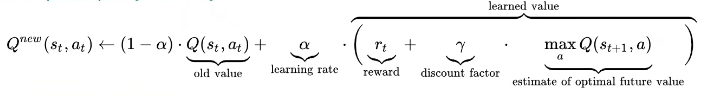

# WHAT IS QL:

Have Q Values for every action you can probably take any action 'a' given the state 's'. ANd over time we update these values such that running through the chain of actions will produce good results, by rewarding the 'agents' that get this done, for long term.

QL is model free learning, it is not environment specific. 

It is good for basic environments. For complex environments, we need to go with Deep Q-Learning.

### Commands: 

`sudo apt install python3-pip`

`pip install gym`
 
`pip install matplotlib`

## The code part:
```python
import gym

# Create the environment with proper rendering mode
env = gym.make("MountainCar-v0", render_mode="human")

# Reset the environment and get the initial state
state, _ = env.reset()

done = False

while not done:
    action = 2  # Push right
    new_state, reward, done, _ = env.step(action)  # Capture all outputs

env.close()
```
`env.reset()` now returns two values: state and info. So we have used
``state, _ = env.reset()``

`env.step(action)` now returns five values: new_state, reward, done, truncated, info.

With this we should see the car trying to go up the hill.

## How is it going to Work:



This is the function for calculating the Q values. Using this math, we are going to make a Q table, that given any combination of states of position and velocity.

Our Agent will initially explore the values for the Q values and then get trained to choose the accurate values for the appropriate results.

So we will build the Q table.

### Understanding QL:
#### α (alpha)
Above in the formula, α (alpha) is the Learning Rate.

Higher alpha value --> Learns faster, but unstable

Lower  alpha value --> Learns slower, but more stable 

We use alpha(usually between 0.1-0.5) so as to maintain some balance so that the Q-values update smoothly but usually don't get stuck. This means new experiences change Q-values by alpha x 100 % each time. The remaining (1-alpha) x 100 % of the old Q-value is retained to ensure stable learning.
####  γ (gamma)
The Discount Factor (γ) decides how much future rewards matter compared to immediate rewards. It discounts future rewards, meaning that rewards far in the future are worth less than immediate rewards.

Now we do it with a bunch of parameters, but in real world, we cannot keep watching every episode and then figure out what these parameters will be. So we track the rewards per episode for most basic environments. 

We do this by tracking a matrix.

## Building our own RL Environment

First install opencv using: 

`pip install opencv-python`

And then 

`pip install pillow`