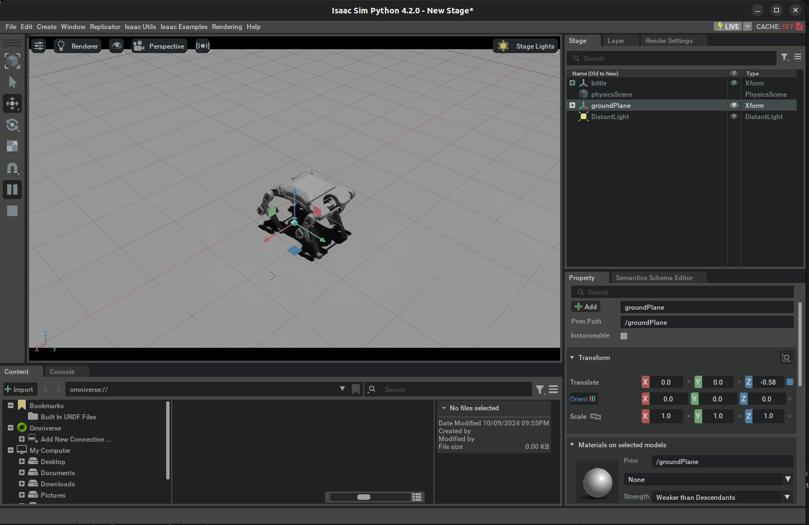

# Quadruped-Isaac-Sim
This project aims to simulate and control a Quadruped robot in the Isaac-Sim simulator and implement the control algorithms and impement a gait motion on the same.

<p align="center"></p>
<p align="center">
  <video width="600" controls autoplay loop muted>
    <source src="assets/bittle_stand.webm" type="video/webm">
 </video>
</p>

### Initial Setup

We have the URDF file as well as the USD file of the robot saved in the ```bittle_description``` folder.
URDF stands for Unified Robot Description Format  and USD stands for Universal Scene Description. These files are used for accessing the Robot's visuals, the initial positioning and joints of the robot and thus to simulate it in the simulating softwares (Isaac-Sim in our case). 


