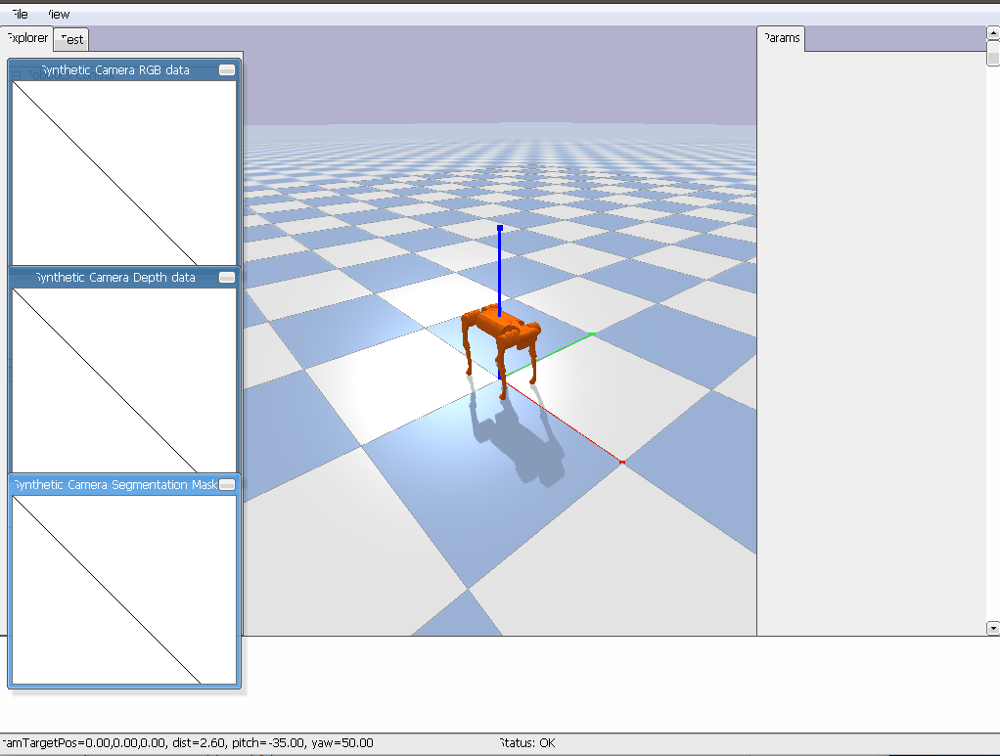

# TRAINING OUR QUADRUPED FOR BASIC WALKING 

Now, after learning some of the basics of RL, let us proceed with how to use RL to train our Quadruped robot. Starting with a very basic example, lets consider to train our robot for satisfying the following objectives:
* Linear velocity only in one direction() = 10 m/s
* No trotting

These are the very two basic cases we will implement initially, and then add more conditions for example maintaining the Torso at some height, some acceleration, gaiting, etc.

For instance, we will be using the A1 Quadruped.




``` python
loadURDF(urdf_path, orientation, quaterion, urdf_flag, fixed_base) : 

# This loads the URDF file in the PyBullet , with the path to the URDF file, the orientation, collision flag and whether the base is fixed(True or False)

getNumJoints(asset) : # Returns the total number of joints in the robot

getJointInfo(asset, joint_id) : 
# This returns a complete set of the joint info in a form of an array

getJointInfo(asset, joint_id)[2] : # Returns the joint type

getJointInfo(asset, joint_id)[8] : # Returns the lower limit of the joint angle

getJointInfo(asset, joint_id)[9] : # Returns the upper limit of the joint angle

```


Now, we have to access the joints and their IDs. By using the ` getJointInfo(asset, joint_id)[i]` to get the joint details for the name of the joint, the link name, and the joint Id. 

The data we receive is : 

``` terminal
Number of joints: 18
Joint ID: 0, Joint Name: floating_base, Link Name: trunk, Lower Limit : 0.0, Upper Limit : -1.0

Joint ID: 1, Joint Name: imu_joint, Link Name: imu_link, Lower Limit : 0.0, Upper Limit : -1.0

Joint ID: 2, Joint Name: FR_hip_joint, Link Name: FR_hip, Lower Limit : -0.802851455917, Upper Limit : 0.802851455917

Joint ID: 3, Joint Name: FR_thigh_joint, Link Name: FR_thigh, Lower Limit : -1.0471975512, Upper Limit : 4.18879020479

Joint ID: 4, Joint Name: FR_calf_joint, Link Name: FR_calf, Lower Limit : -2.69653369433, Upper Limit : -0.916297857297

Joint ID: 5, Joint Name: FR_foot_fixed, Link Name: FR_foot, Lower Limit : 0.0, Upper Limit : -1.0

Joint ID: 6, Joint Name: FL_hip_joint, Link Name: FL_hip, Lower Limit : -0.802851455917, Upper Limit : 0.802851455917

Joint ID: 7, Joint Name: FL_thigh_joint, Link Name: FL_thigh, Lower Limit : -1.0471975512, Upper Limit : 4.18879020479

Joint ID: 8, Joint Name: FL_calf_joint, Link Name: FL_calf, Lower Limit : -2.69653369433, Upper Limit : -0.916297857297

Joint ID: 9, Joint Name: FL_foot_fixed, Link Name: FL_foot, Lower Limit : 0.0, Upper Limit : -1.0

Joint ID: 10, Joint Name: RR_hip_joint, Link Name: RR_hip, Lower Limit : -0.802851455917, Upper Limit : 0.802851455917

Joint ID: 11, Joint Name: RR_thigh_joint, Link Name: RR_thigh, Lower Limit : -1.0471975512, Upper Limit : 4.18879020479

Joint ID: 12, Joint Name: RR_calf_joint, Link Name: RR_calf, Lower Limit : -2.69653369433, Upper Limit : -0.916297857297

Joint ID: 13, Joint Name: RR_foot_fixed, Link Name: RR_foot, Lower Limit : 0.0, Upper Limit : -1.0

Joint ID: 14, Joint Name: RL_hip_joint, Link Name: RL_hip, Lower Limit : -0.802851455917, Upper Limit : 0.802851455917

Joint ID: 15, Joint Name: RL_thigh_joint, Link Name: RL_thigh, Lower Limit : -1.0471975512, Upper Limit : 4.18879020479

Joint ID: 16, Joint Name: RL_calf_joint, Link Name: RL_calf, Lower Limit : -2.69653369433, Upper Limit : -0.916297857297

Joint ID: 17, Joint Name: RL_foot_fixed, Link Name: RL_foot, Lower Limit : 0.0, Upper Limit : -1.0

```

We require these lower and upper limits, so that our RL angent when taking any action should always choose the values in the range between these lower and upper limits.
